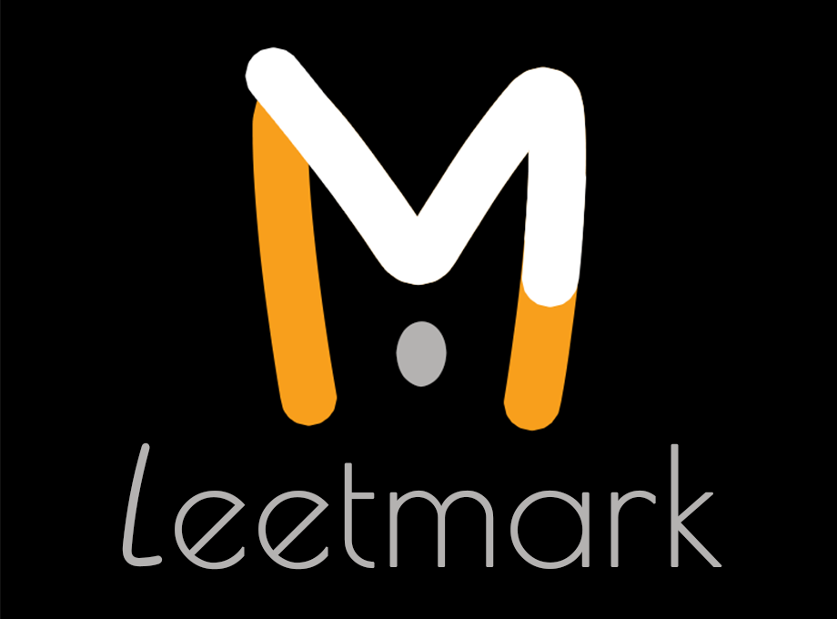

# Leetmark

  

Share your ingenious Leetcode solutions like a boss.

Leetmark generates a decent Github Flavored Markdown template from a Leetcode problem page.

Meta data is stored as Front Matter from which Github will generate a neat data table. Also useful for other blog frameworks.

Additional JSON data export.

See [sample.md](sample.md) for template example.
